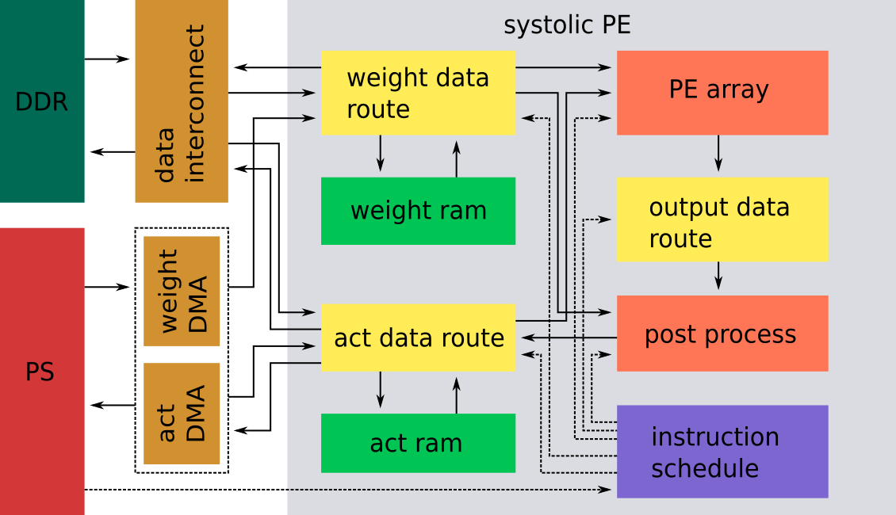

> 需要修改下示意图, 细化到 block design 中各个 IP, 如 verilog IP, DMA IP 等. 画清楚 verilog IP 中的结构.
> 计划将数据调度模块和计算模块打包为独立模块.
$$
$$
# 1 Top Block

Top block is shown as following figure,

<p style="text-align:center;">

</p>

with:

- Line:

  - Solid line represent data flow.

  - Dotted line represent instruction flow.

- Block:

  - orange: computation IP

  - yellow: data route IP

  - green: RAM

**All process IP have bypass state. (PE bypass for only max pooling layer)**

# 2 IP specification:
## 2.1 act data route
> pingpong
>
> need to support two input and two output at same time
### 2.1.1 Control mode

- Configuration submodule: Set by instruction schedule

- Transfer submodule: Transfer data according to configuration submodule.


### 2.1.2 Instruction

- Data source

- Data sink

- Data address

- Data size


## 2.2 weight data route
> pingpong
>
> mode $1 \times 1$ and mode $3 \times 3$
### 2.2.1 Control mode

- Configuration submodule: Set by instruction schedule

- Transfer submodule: Transfer data according to configuration submodule.


### 2.2.2 Instruction

- Data source

- Data sink

- Data address

- Data size


## 2.3 output data route
> Two kind of mode: weight tiling and activation tiling.
### 2.3.1 Function

Output result of PE array (parallelsim is 64) to post process module (input parallelism is 4).


### 2.3.2 Instruction

- Data source

- Data sink

- Data address

- Data size


## 2.4 post process
> Bias data config optimization
### 2.4.1 FSM

- Idle

- Config

- Post process


### 2.4.2 Instruction

- Relu instruction

- Bias instruction

- Downsampling and upsampling instruction

- Bitwidth instruction


## 2.5 PE array
### 2.5.1 FSM

- Idle

- Work


### 2.5.2 Control Signal
#### Output signal

- `weight_data_status`:

  - not ready

  - current data ready

  - preload data ready


#### Input signal

- `computation_finish`


### 2.5.3 Note

**问题: 如何判断当前帧计算完成?**

权重数据存在 PE 阵列中, 激活值数据流开始流入计算阵列.

ping-pong 中的数据都存好可以保证激活值数据流不停.

权重数据和激活值数据分开配置, 激活值数据控制计算状态.

PE 提供权重是否初始化/更新完成的控制信号.


# 3 Data Schedule
## 3.1 Activation data schedule

下述所示, 为权重分块模式下输入数据调度伪代码
```python
# Weight Tiling
# index: full_repeat_cnt
# range: out_full_repeat_num
for w_tile
  for img_h

    # index: dout_repeat_cnt
    # range: act_repeat_num
    # `64` represent parallelism degree
    for w_tile_o_ch / 64

      # index: act_raddr
      # range: act_line_len
      # `4` represent input parallelism degree
      for img_ch / 4; for img_w
          act_raddr++
          act_out_1
          act_out_2
          act_out_3
          act_out_4

      act_raddr = act_offset

    # act_line_len =  raddr_per_line = 0x1a0
    act_offset += raddr_per_line

  act_offset = 0
```

## 3.2 PE cluster schedule

简述 PE 阵列计算方法. 其中, 对权重分块做如下说明;

- DDR 位宽为 128 bits.

- 在一组 128 bits 中储存 BUS128_DATA_WEIGHT_NUM 个位宽为 DATA_WEIGHT_WIDTH bits 的数据.

- DDR 中一个地址存储一个 byte 的数据, 即相邻两组 128 bits 的数据, 地址变化为 0x10.

- weight_size_ddr, index_weight_ddr, TILE_WEIGHT_DDR_SIZE 均为 以 128 bits 为单位的索引，即当 weight_size_ddr + 1 时，对应 DDR 中地址加 0x10.

- weight_tile_ddr_size: 每个分块 (tiling) 所需的以 128 bits 为单位的 DDR 存储空间. 计算方式为剩余需要处理的权重个数和一个分块 (tiling) 所能容纳的数据个数的最小值.

- weight_size_ddr: 初始化为以 128 bits 为单位的, 一个 tiling weight 对应的片上所需存储空间. 每完成一个分块 (tiling) 的计算后, 减去分块消耗的 weight 数据 (即得到剩余未处理的 weight 数据个数). 需要注意的是, 由于在当前设计中 weight 的基地址永远是0. 所以用 `weight_size_ddr - index_weight_ddr` 的方式代替上述计算. 当基地址不为 0 时, 这里要有优化.

- index_weight_ddr: 每个 weight 分块读取时的基地址, 以 128 bits 为单位.

下述所示, 为 PE 阵列计算调度伪代码.
```python
# row == row_in_tile or ch_out == ch_out_in_tile
# Input data layout:
#   ( row/row_in_tile, row_in_tile, ch_in/paral_data, column, paral_data )
# Output data layout:
#   ( row/row_in_tile, ch_out/ch_out_in_tile,
#     row_in_tile, ch_out_in_tile/paral_pe, column, paral_pe )

# 完整权重数据和激活值数据的分块个数, 以定点数 (浮点数) 个数为单位.
OYT = ceil(input_size / (double)TILE_ACT_SIZE);
OFT = ceil(kernel_size / (double)TILE_WEIGHT_SIZE);

# 每个分块中, 需要按输入通道复用算子的次数.
IN_F = nInputPlane / IN_PARAL;

# 加载分块 weight (tiling_weight) 数据的循环
for oft = 1: OFT
  UpdateWeight           # Update weight for next tile. Load from DDR.
  ResetAct               # Repeat activation in tile.

  # 加载分块 act (tiling_act) 数据的循环
  for oyt = 1: OYT
    ResetWeight         # Repeat weight in tile
    UpdateAct           # Update activation for next tile. Load from DDR.

    # 每个 tiling_act 中包含激活值行数的循环.
    for oy = 1: OY
      ResetWeight       # Repeat weight in tile
      UpdateAct         # Update activation in row

      # 每个 tiling_weight 中输出通道的循环.
      for of = 1: OF
        UpdateWeight    # Update weight in output channels
        ResetAct        # Repeat activation data in tile

        # 每个分块中输入通道的循环.
        for in_f = 1: IN_F
          UpdateWeight  # Update weight in input channels
          UpdateAct     # Update activation in input channels
          Calculation   # 64*4*3*3 PE cluster
```


## 3.3 Output data schedule

下述所示, 为输出数据调度伪代码
```python
# Input data layout:
#   ( row/row_in_tile, ch_out/ch_out_in_tile,
#     row_in_tile, ch_out_in_tile/paral_pe, column, paral_pe )
# Inter data layout:
#   ( row/row_in_tile, ch_out/ch_out_in_tile,
#     row_in_tile, ch_out_in_tile/paral_pe, paral_pe / para_data,
#     column, paral_data )
# Output data layout:
#   ( row, ch_out/paral_data, column, paral_data )

# row_tile_num * row_in_tile = total_row_num
for row_tile_num

  # output_ch_tile_num * output_ch_in_tile = total_output_ch_num
  for output_ch_tile_num                       # --> `total_cnt` in verilog

    for row_in_tile                            # --> `line_cnt` in verilog

      # `output_pe_paral` represents output parallelism degree of PE.
      for output_ch_in_tile / output_pe_paral
        for column
          # - Output of PE cluster will be stored in x FIFO at once.
          # - In verilog, there are 8 fifo, which data width is 128 bits.
          # - At same time, PE cluster output bandwidth is 64 output channels,
          #   which data width is 16 bits.
          StorePixel2Fifo1
          StorePixel2Fifo2
          ...
          StorePixel2FifoX
```


## 3.4 索引变换

下述所示是各个数据分布间的索引变换方式.
```
PE Input data layout:
  ( row/row_in_tile, row_in_tile, ch_in/paral_data, column, paral_data )

Conv Output data layout:
  ( row/row_in_tile, ch_out/ch_out_in_tile,
    row_in_tile, ch_out_in_tile/paral_pe, column, paral_pe )

Reorder data layout:
  ( row/row_in_tile, ch_out/ch_out_in_tile,
    row_in_tile, ch_out_in_tile/paral_pe, paral_pe / para_data,
    column, paral_data )

PE output data layout:
  ( row, ch_out/paral_data, column, paral_data )
```


